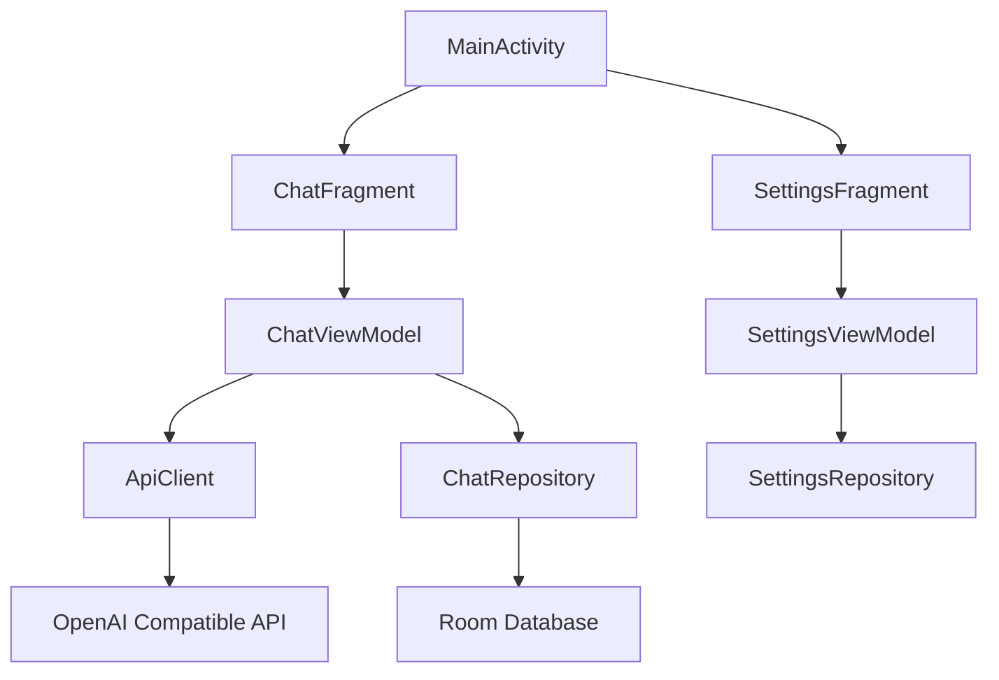

# Android AI Chat Application

Feature Name: android-ai-chat
Updated: 2026-07-12

## Description

Android 原生应用，支持配置自定义 AI API 端点，提供 Material Design 风格聊天界面，支持本地保存聊天记录。

## Architecture



## Components and Interfaces

### Activities and Fragments

- **MainActivity**: 应用主入口，包含导航到聊天和设置
- **ChatFragment**: 聊天主界面，显示消息列表和输入框
- **SettingsFragment**: API 配置界面，管理 API 密钥和模型参数

### ViewModels

- **ChatViewModel**: 管理聊天状态，处理消息发送和接收
- **SettingsViewModel**: 管理设置状态，验证和保存配置

### Repositories

- **ChatRepository**: 数据层，处理聊天记录的 CRUD 操作
- **SettingsRepository**: 管理应用配置的读取和存储

### Network Layer

- **ApiClient**: 基于 OkHttp 的 HTTP 客户端，支持 OpenAI 兼容 API 格式

## Data Models

### ChatMessage

```kotlin
@Entity(tableName = "messages")
data class ChatMessage(
    @PrimaryKey val id: String,
    val sessionId: String,
    val content: String,
    val isUser: Boolean,
    val timestamp: Long
)
```

### ChatSession

```kotlin
@Entity(tableName = "sessions")
data class ChatSession(
    @PrimaryKey val id: String,
    val title: String,
    val lastMessage: String,
    val updatedAt: Long
)
```

### ApiConfig

```kotlin
@Entity(tableName = "api_config")
data class ApiConfig(
    @PrimaryKey val id: Int = 1,
    val endpoint: String,
    val apiKey: String,
    val model: String
)
```

## Correctness Properties

- API 端点必须以 https:// 开头
- API 密钥不能为空
- 每个会话的消息按时间戳排序
- 用户消息和 AI 回复交替显示

## Error Handling

- 网络错误：显示重试按钮和错误提示
- API 认证失败：跳转到设置页面
- 空配置：禁用聊天功能并提示配置

## Build Configuration

使用 Gradle 构建，最终输出 APK 文件到仓库根目录。

## References

[^1]: Android Developer Guide - [Room Persistence Library](https://developer.android.com/training/data-storage/room)
[^2]: OpenAI API Documentation - [Chat Completions API](https://platform.openai.com/docs/api-reference/chat)