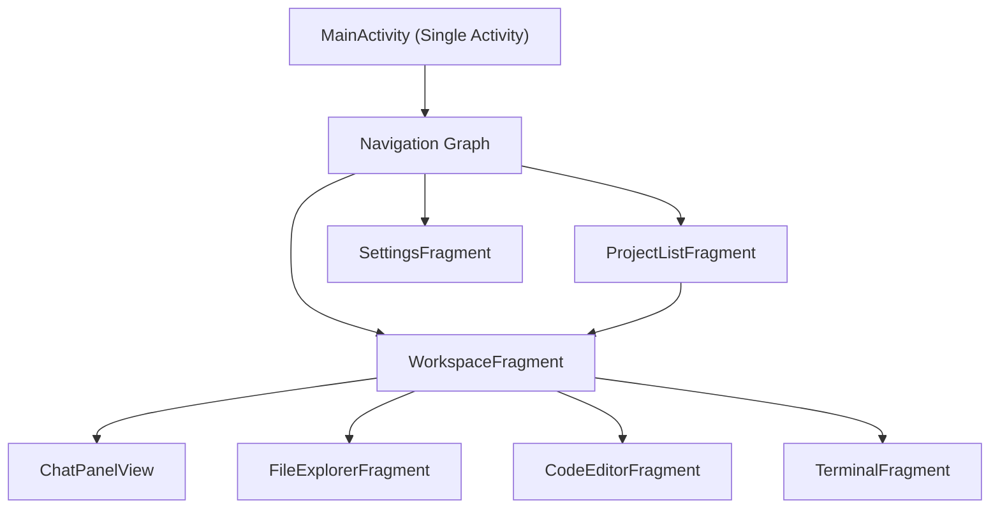
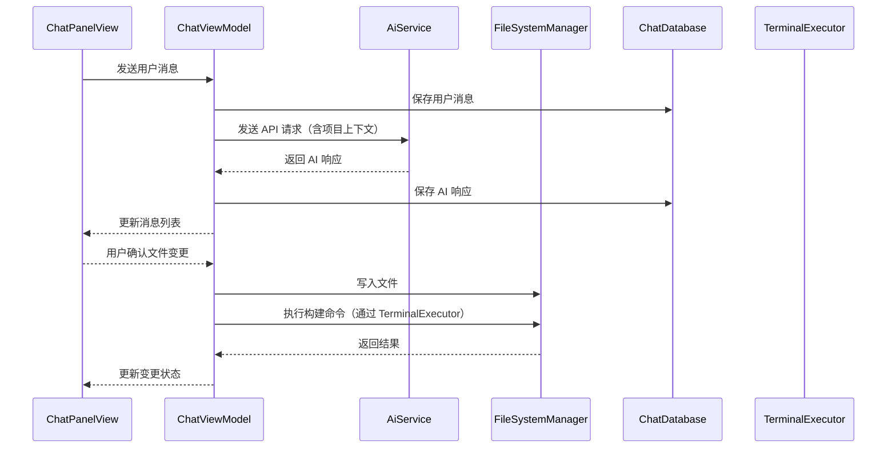

# AI 编程助手 - 技术设计文档

Feature Name: ai-coding-assistant
Updated: 2026-07-17

## Description

AI 编程助手是一个 Android 原生应用，集成远程大模型 API，提供项目管理、AI 对话编程、文件编辑和终端操作能力。采用单 Activity 多 Fragment 架构，使用 ViewModel + LiveData 进行状态管理，Room 数据库持久化配置和会话数据。

## Tech Stack

| 类别 | 选型 | 说明 |
|------|------|------|
| UI 框架 | View-based (XML) | 传统 XML 布局 + Fragment，兼容性好 |
| 架构组件 | ViewModel + LiveData + Navigation | Jetpack 标准架构组件 |
| 网络库 | OkHttp | 轻量级 HTTP 客户端，支持流式 SSE 响应 |
| 本地数据库 | Room | 存储会话历史和聊天消息 |
| 配置存储 | SharedPreferences | 存储 AI 配置和项目元数据 |
| 最低 SDK | API 26 (Android 8.0) | 利用现代 API，简化终端等功能的实现 |
| 目标 SDK | API 31 | 与当前项目配置保持一致 |

## Architecture



MainActivity 作为单 Activity 宿主，通过 Jetpack Navigation 管理三个主页面：
- ProjectListFragment：项目列表
- SettingsFragment：AI 配置管理
- WorkspaceFragment：项目工作区（包含聊天、文件浏览、代码编辑、终端四个子面板）

## Components and Interfaces

### 1. AI 配置管理组件

| 组件 | 职责 |
|------|------|
| `SettingsFragment` | 展示配置列表和添加/编辑表单 |
| `SettingsViewModel` | 管理配置列表状态，CRUD 操作 |
| `AiConfigRepository` | 数据层抽象，封装 SharedPreferences 读写 |
| `AiConfig` | 数据模型：id, alias, apiKey, baseUrl, modelName |

### 2. 项目管理组件

| 组件 | 职责 |
|------|------|
| `ProjectListFragment` | 展示已导入项目列表和导入入口 |
| `ProjectListViewModel` | 管理项目列表状态 |
| `ProjectRepository` | 项目元数据持久化（Room），项目目录有效性校验 |
| `Project` | 数据模型：id, name, rootPath, importTime |

### 3. AI 聊天组件

| 组件 | 职责 |
|------|------|
| `ChatPanelView` | 聊天 UI：消息列表 + 输入框，消息气泡渲染 |
| `ChatViewModel` | 管理消息流、API 调用状态 |
| `AiService` | 封装 OkHttp 调用大模型 Chat Completion API，支持 OpenAI 兼容接口 |
| `CodeBlockRenderer` | 聊天消息中代码块的语法高亮渲染 |

### 4. 文件系统组件

| 组件 | 职责 |
|------|------|
| `FileExplorerFragment` | 树形文件浏览器，文件/目录的展示与点击 |
| `FileExplorerViewModel` | 维护当前目录的文件列表状态 |
| `FileSystemManager` | 封装 java.io.File 操作：遍历目录、读取文件、写入文件 |
| `CodeEditorFragment` | 代码编辑器：行号、语法高亮、保存操作 |

### 5. 终端组件

| 组件 | 职责 |
|------|------|
| `TerminalFragment` | 终端 UI：命令输入 + 输出展示 |
| `TerminalViewModel` | 管理命令执行状态 |
| `TerminalExecutor` | 使用 ProcessBuilder 在项目根目录执行 shell 命令，异步读取 stdout/stderr |

### 6. 会话管理组件

| 组件 | 职责 |
|------|------|
| `SessionListDialog` | 历史会话列表弹窗 |
| `ChatDatabase` | Room 数据库，存储 ChatSession 和 ChatMessage |
| `SessionDao` / `MessageDao` | Room DAO 接口 |

### 组件交互流程



## Data Models

### Room 数据库

```
ChatDatabase
├── chat_sessions
│   ├── id: Long (PK)
│   ├── projectId: String
│   ├── title: String
│   └── createdAt: Long
└── chat_messages
    ├── id: Long (PK)
    ├── sessionId: Long (FK → chat_sessions.id)
    ├── role: String (user / assistant / system)
    ├── content: String
    └── timestamp: Long
```

### SharedPreferences

```
Key: active_ai_config_id  → String (当前活跃配置 ID)
Key: ai_configs            → JSON Array (所有 AI 配置列表)
Key: imported_projects     → JSON Array (所有已导入项目列表)
```

### AiConfig (JSON)

```json
{
  "id": "uuid-string",
  "alias": "DeepSeek",
  "apiKey": "sk-****",
  "baseUrl": "https://api.deepseek.com/v1",
  "modelName": "deepseek-chat"
}
```

### 项目文件上下文（发送给 AI）

```json
{
  "projectName": "MyApp",
  "files": [
    { "path": "app/build.gradle", "content": "..." },
    { "path": "app/src/main/...", "content": "..." }
  ]
}
```

## Correctness Properties

- AI 配置的 API Key 仅在应用内存储于 SharedPreferences，不在日志或界面中明文展示
- 文件写入操作必须在用户确认 diff 预览后才执行，AI 不能绕过确认直接写文件
- 终端命令以项目根目录为工作目录执行，确保构建和 Git 操作在正确的路径下
- 会话切换时自动保存当前聊天状态，防止消息丢失
- 应用退出时主动关闭终端子进程，防止进程泄漏

## Error Handling

| 场景 | 处理策略 |
|------|---------|
| AI API 认证失败（401） | 提示用户检查 API Key，引导跳转到设置页面 |
| AI API 网络超时 | 展示超时提示并提供重试按钮，超时时间设为 60 秒 |
| AI API 返回格式异常 | 捕获 JSON 解析错误，展示"模型响应异常"通用提示 |
| 项目目录被删除 | 检测目录不存在时标记项目为无效状态，提示用户重新导入 |
| 文件写入权限不足 | 捕获 IOException，展示具体文件路径和错误原因 |
| 终端命令执行失败 | 展示 exit code 和 stderr 输出，不做自动重试 |
| Room 数据库操作异常 | 捕获异常并降级为仅使用内存数据 |

## Test Strategy

### 单元测试（JUnit + Mockito）
- `AiConfigRepository` CRUD 操作
- `AiService` API 请求构造和响应解析
- `FileSystemManager` 目录遍历和文件读写
- `TerminalExecutor` 命令执行和输出捕获

### UI 测试（Espresso）
- 设置页面：添加/编辑/删除 AI 配置的完整流程
- 项目列表：导入有效/无效项目的场景验证
- 聊天界面：消息发送、代码块渲染、diff 确认流程

### 集成测试
- Room 数据库迁移和查询正确性
- 完整的会话创建→对话→文件修改→终端执行的端到端流程
